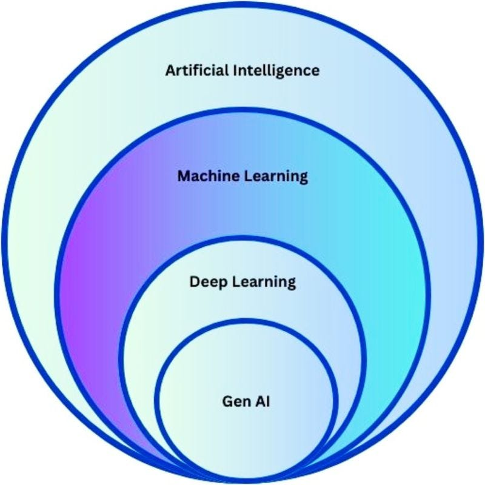

 
Nội dung bài này sẽ đề cập và giải thích khái quát các nguyên lý cơ bản đứng sau những mô hình ngôn ngữ lớn. Tiếp đó sẽ giúp bạn hiêu sâu về kiến trúc Transformer - nền tảng tạo nên các mô hình ngôn ngữ lớn. Sau đó, dựa vào những kiến thức cơ sở này để thiết lập lộ trình xây dựng một mô hình ngôn ngữ lớn từ đầu.

## Nội dung chính

+ [**Khái niệm về LLMs**](#khái-niệm-về-llms)
+ [**Ứng dụng của LLMs**](#nội-dung-chính)
+ [**Các giai đoạn xây dựng và sử dụng LLMs**]()
+ [**Kiến trúc Transformer**]()
+ [**Khai thác và sử dụng các tập dữ liệu lớn**]()
+ [**Khám phá kiến trúc mô hình ChatGPT**]()
+ [**Lộ trình xây dựng mô hình LLMs từ đầu**]() 

## Khái niệm về LLMs

Mô hình ngôn ngữ lớn (Large Language Models - LLMs) có thể hiểu một cách đơn giản là một mạng nơ-ron (neural network) được thiết kế với mục đích để hiểu, tạo ra và phản hồi các văn bản giống như con người. Những mô hình này được huấn luyện trên một lượng dữ liệu văn bản khổng lồ, những nguồn dữ liệu này được thu thập và lấy từ các văn bản có sẵn trên internet. 

Từ **"large"** trong **"large language model"** ngầm chỉ ra rằng đây là những mô hình có kích thước rất lớn ở cả số lượng tham số và dữ liệu mà chúng được huấn luyện. Đến thời điểm hiện tại có rất nhiều mô hình LLMs nổi bật và biến thể của chúng, điểm chung của các mô hình này đều thường có hàng chục hoặc thậm chí hàng trăm tỷ tham số, đây là những tham số có thể được tinh chỉnh trong những mạng nơ-ron sâu, phục vụ cho quá trình tối ưu hóa trong giai đoạn huấn luyện, nhằm giải quyết các nhiệm vụ ngôn ngữ khác nhau. Một ví dụ điển hình là khả năng dự đoán từ tiếp theo trong một chuỗi văn bản - một nhiệm vụ đơn giản nhưng mang lại nền tảng cho nhiều ứng dụng phức tạp hơn.

Các mô hình ngôn ngữ lớn sử dụng một kiến trúc có tên là **"transformer"**. Kiến trúc này giúp LLMs hiểu và xử lý được những chi tiết quan trọng trong văn bản. thay vì đọc và hiểu tất cả các từ một cách như nhau thì chúng sẽ để ý hơn tới những từ có ý nghĩa quan trọng hoặc làm nổi bật vấn đề của câu, từ đó giúp diễn giải tốt hơn ngôn ngữ con người - vốn rất phức tạp và nhiều tầng nghĩa.

Trí tuệ nhân tạo (Artificial Intelligence - AI) như chúng ta được biết - một lĩnh vực rộng lớn nhằm tạo ra những cỗ máy có thể thực hiện các nhiệm vụ đòi hỏi trí tuệ giống như con người. Học máy (Machine Learning - ML) và học sâu (Deep Learning - DL) là một trong những phân nhánh quan trọng của AI. Trong đó ML cho phép hệ thống học hỏi từ dữ liệu mà không cần được lập trình rõ ràng cho từng tác vụ, còn học sâu là một bước tiến xa hơn, sử dụng các mạng nơ-ron nhân tạo nhiều lớp để xử lý các dữ liệu có cấu trúc phức tạp như hình ảnh, âm thanh và ngôn ngữ. Vì các mô hình ngôn ngữ lớn có khả năng tạo ra văn bản, nên chúng cũng được xem là một dạng của trí tuệ nhân tạo (**Hình 1.1**) và thường được gọi là trí tuệ nhân tạo tạo sinh (generative AI - GenAI). 

<figure style="text-align: center;">
  
  <figcaption><strong>Hình 1.1:</strong> Mối quan hệ giữa AI, ML, DL và GenAI.</figcaption>
</figure>

Hiện nay AI đang bị chi phối rất nhiều bởi Machine Learning và Deep Learning, nhưng ngoài ra chúng cũng có nhiều cách tiếp cận khác, chẳng hạn như việc sử dụng rule-based-systems (hệ thống có quy tắc), genetic algorithms (thuật toán di truyền), expert systems (hệ thống chuyên gia), fuzzy logic (tư duy mờ), hoặc symbolic reasoning (lý luận ký hiệu). 

Để làm rõ hơn

 

 | [**<-- Previous**](../) | [**Lecture01**]() | [**Next -->**](../../representation/directed/)|